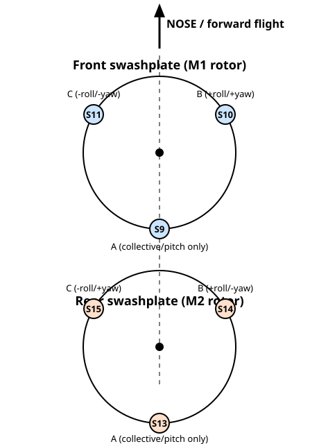
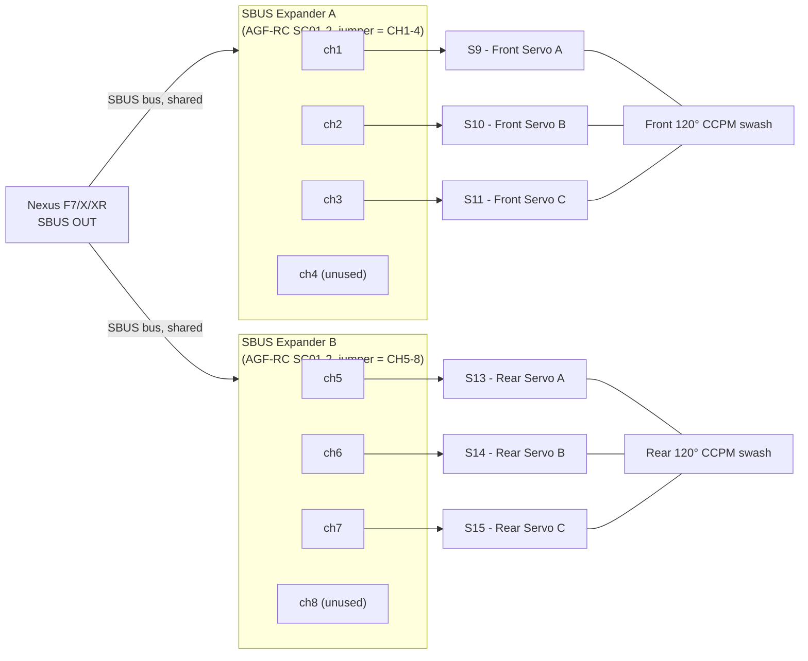
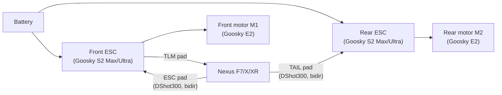

# CH-47 Chinook (Tandem Rotor) Mixer

This document explains how to configure Rotorflight's generic mixer to fly a CH-47 Chinook
style **tandem rotor** helicopter with:

- 2x DShot ESCs / motors (front rotor = `M1`, rear rotor = `M2`)
- 2x 120° CCPM swashplates (3 servos each, 6 servos total)
- All 6 servos wired to the FC's **SBUS output** (serial bus servos), not PWM pins

It also shows the CLI commands needed to enable the **dual-motor governor**, so both rotors
are held at the exact same headspeed.

## 1. Parts list

The build this document is written for uses:

| Qty | Part |
| --- | ---- |
| 2x  | Goosky E2 motor (front/rear rotor) |
| 2x  | Goosky S2 Max/Ultra ESC (bidirectional DShot, one per motor) |
| 2x  | [AGF-RC SC01-2 3G super micro signal convert module](https://vgr-rc.de/p/agf-rc-professionell-rc-sc01-2-3g-super-micro-signal-convert-module-sbus-ppm-to-pwm-decoder) - 4-channel SBUS-to-PWM expander, jumper-selectable CH1-4/CH5-8 |
| 1x  | Nexus F7/Nexus X/Nexus XR FrSky 007 flight controller |
| 2x  | OpenScale200 chassis |

The two SBUS expanders are the "2x 4Ch SBUS expanders" referenced throughout this document
(see [section 4, servo layout](#4-servo-layout-used-below)) - one jumpered to `CH1-4` for
the front swash, the other to `CH5-8` for the rear swash, both wired to the same SBUS
output of the flight controller.

### 1.1 Physical layout: rotor separation (no rotor sync)

A real CH-47 lets its rotor discs overlap (~30%) because a synchronizing shaft/gearbox
keeps the two rotors at a fixed relative phase angle, so the blades interleave like
scissors and can never occupy the same space at the same time. This build uses two
**independent** motors/governors with no mechanical or electronic phase lock, so that
trick is not available - at any instant the two rotors can be at *any* relative phase,
including the worst case of both blades pointing straight at each other. The physical
layout must therefore guarantee:

> **The two rotor discs must never touch, under any phase relationship.** Design this as
> two completely separate, non-overlapping rotor systems, not a scaled-overlap Chinook.

Reference dimensions for a stock Goosky S2/S2 Max/S2 Ultra rotor system:

| Spec | Value |
| ---- | ----- |
| Main rotor diameter (`D`) | ~440-444 mm |
| Main rotor radius (`R`) | ~220-222 mm |

**Horizontal spacing (mast-to-mast, fore/aft):** the bare minimum with zero margin is
`R_front + R_rear = D` (≈440 mm for two equal stock rotors). Build in margin for blade
flap/coning, gusts, fuselage/boom flex and build tolerance:

```
horizontal spacing = 1.2 - 1.3 x D  ≈  530 - 575 mm (mast centerline to mast centerline)
```

**Vertical offset (rear rotor plane raised):** add vertical stagger as a second,
independent layer of protection, so a single-axis error (e.g. boom sag, a hard pitch
excursion) doesn't remove all your margin at once. As a sanity check, 8° of blade flap
moves the tip vertically by `R x sin(8°) ≈ 222 mm x 0.139 ≈ 31 mm`, so a stagger smaller
than that buys almost nothing:

```
vertical stagger = 60 - 80 mm, rear rotor tip-path-plane above the front rotor's
```

Raising the rear rotor also lifts it partly clear of the front rotor's direct downwash,
which helps pitch/yaw stability since there is no control-law coupling between the two
independent governors to compensate for wake interaction.

**Scale:** keep the stock S2 blades/drivetrain (no rotor re-engineering needed) and get
the required separation from a stretched boom/frame joining the two chassis:

- Rotor spacing (mast-to-mast): ~550 mm
- Vertical stagger: ~70 mm, rear higher
- Overall tip-to-tip length (nose rotor overhang + spacing + tail rotor overhang):
  ≈ 550 + 440 ≈ 990 mm

This puts the model at roughly **1:30-1:40 scale** versus a real CH-47 (18.29 m rotor
diameter, ~30 m rotor-tip-to-tip length) - a reasonable "big micro" tandem, just with
non-overlapping discs instead of the real aircraft's intermeshing geometry.

## 2. How the Rotorflight mixer engine works

Rotorflight does not use fixed "mixer presets" (TRI/QUAD/HELI120/...) like old Cleanflight.
Instead it has a small generic mixing engine:

- **Inputs** – named signals such as stabilized roll/pitch/yaw/collective/throttle
  (`SR`, `SP`, `SY`, `SC`, `ST`, `ST2`, ...), RC channels, etc. Each input has a `rate`
  (scale) and `min`/`max` limit, configurable with `mixer rate` / `mixer limit`.
- **Outputs** – servo channels `S1`...`S26` and motor channels `M1`...`M4`.
- **Rules** – up to 32 entries of the form
  `mixer rule <index> <SET|ADD|MUL> <input> <output> <weight> <offset>`,
  each rule multiplies one input by a weight (and adds an offset), then
  `SET`s, `ADD`s or `MUL`s it into one output. Multiple rules can accumulate onto the
  same output (first rule `set`, following rules `add`), which is exactly what lets us
  build two independent swashplates from simple linear terms.

For a normal single-rotor helicopter, `swash_type` auto-generates the rules for you
(collective + cyclic roll/pitch onto 3-4 servos, throttle onto `M1`). A tandem rotor
aircraft has **two** swashplates that must move in specific combinations for each control
axis, so we turn the automatic swash mixing **off** (`swash_type = NONE`) and build the
whole mixer by hand with `mixer rule`.

## 3. CH-47 control theory

A tandem rotor helicopter has no tail rotor. Both rotors are collective+cyclic (120° CCPM)
and counter-rotate to cancel torque. The 4 flight axes map onto the two swashplates like
this (the same scheme used on real Chinooks and most RC tandem-rotor models):

| Stick        | Effect                                                                 |
| ------------ | ----------------------------------------------------------------------- |
| Collective   | Same collective pitch on **both** rotors → climb/descend                |
| Roll         | Same lateral cyclic tilt on **both** rotors (front and rear tilt the same way) → roll, just like a single-rotor helicopter |
| Pitch        | **Differential collective**: front rotor collective increases while rear decreases (or vice-versa) → pitch moment, because the rotors are separated fore/aft |
| Yaw          | **Differential lateral cyclic**: front and rear tilt sideways in *opposite* directions → yaw moment, again because of the fore/aft separation |

So each swashplate servo receives:

```
servo = collective_common ± pitch_differential   (uniform/"collective" component)
      ± roll_common ± yaw_differential            (tilt component, only on 2 of the 3 servos)
```

with the sign of the differential terms flipped between the front and rear swashplate.

This is mechanically identical to a standard 120° CCPM swash (same `0.5` / `0.866` factors
used by the built-in `swash_type = CP120`), we are simply feeding the *pitch stick* into the
"collective" term and the *yaw stick* into the "roll/tilt" term of the rear swash with the
opposite sign.

## 4. Servo layout used below

Each swashplate uses the same servo roles as a normal 120° CCPM setup:

- **Servo A** – arm on the roll axis (no roll/yaw authority, only collective/pitch)
- **Servo B** – arm at +120° (positive roll & yaw contribution)
- **Servo C** – arm at −120° (negative roll & yaw contribution)

Physical arrangement of both swashplates as seen from above, nose pointing up (forward
flight direction) - Servo A sits at the rear of each swash (on the fuselage centerline),
with Servo B/C at ±120° from it, front-right/front-left respectively:



Since all 6 servos are driven over **SBUS**, they must use servo slots `S9`-`S26`
(slots `S1`-`S8` are PWM-pin only, see [`Mixer.md`](Mixer.md) / [`Serial.md`](Serial.md)).
Servo slot `Sn` maps to SBUS-output channel `n - 9` (0-based), i.e. `S9` = SBUS channel 1,
`S10` = SBUS channel 2, and so on.

This build uses **two 4-channel SBUS servo expanders** on the same SBUS output to reach
all 6 bus servos, each expander wired with a jumper that selects which group of 4 channels
(1-4 or 5-8) it decodes:

| Expander | Jumper setting | Channels decoded | Channels actually wired | Swashplate |
| -------- | -------------- | ----------------- | ------------------------ | ---------- |
| A        | CH1-4          | 1, 2, 3, 4         | 1, 2, 3 (4th port unused) | Front      |
| B        | CH5-8          | 5, 6, 7, 8         | 5, 6, 7 (8th port unused) | Rear       |

Because the two expanders don't decode contiguous channel groups, the rear swash servos
sit on `S13`-`S15` (SBUS channels 5-7), **not** `S12`-`S14` - `S12` (channel 4) and `S16`
(channel 8) are left unused on purpose so each expander's spare 4th port can be wired to a
future/spare servo if needed:

| Swashplate | Servo A | Servo B | Servo C | Unused expander port |
| ---------- | ------- | ------- | ------- | --------------------- |
| Front      | S9      | S10     | S11     | S12 (expander A, ch4)  |
| Rear       | S13     | S14     | S15     | S16 (expander B, ch8)  |

### 4.1 Wiring schematic



If you are instead driving some servos from PWM pins, just replace the servo names with
`S1`-`S8` accordingly - the `mixer rule` values themselves don't change.

## 5. CLI configuration

### 5.1 Enable SBUS servo output

```
serial <UART_id> 262144 115200 115200 115200 115200
set sbus_out_frame_rate = 100
```

- `262144` is the `SBUS_OUT` serial function bit - assign it to whichever UART your bus
  servos are wired to (see `serial` in [`Cli.md`](Cli.md) for the full syntax).
- `bus_servo_source_type` selects, per SBUS channel (0-17), whether that channel is driven
  by the mixer (`0`) or passed through from the RX (`1`). Channels 0-7 (`S9`-`S16`, i.e. both
  expanders' full 4+4 channel range, including the two unused expander ports) default to
  mixer-driven already, so no change is needed for this setup.

### 5.2 Turn off the built-in single-swash mixer

```
set swash_type = NONE
set tail_rotor_mode = VARIABLE
```

(`tail_rotor_mode` is irrelevant for a Chinook since there's no tail rotor, but leaving it
at its default keeps the built-in tail logic - which we don't use - fully disabled.)

### 5.3 Reset and build the custom mixer rules

```
mixer rule reset
```

**Front swashplate (`M1`'s rotor) - servos S9/S10/S11:**

```
mixer rule  0 set SC S9   500    0   # Servo A: collective
mixer rule  1 add SP S9   500    0   # Servo A: + differential pitch (front)

mixer rule  2 set SC S10  500    0   # Servo B: collective
mixer rule  3 add SP S10  500    0   # Servo B: + differential pitch (front)
mixer rule  4 add SR S10  866    0   # Servo B: + roll (common)
mixer rule  5 add SY S10  866    0   # Servo B: + differential yaw (front)

mixer rule  6 set SC S11  500    0   # Servo C: collective
mixer rule  7 add SP S11  500    0   # Servo C: + differential pitch (front)
mixer rule  8 add SR S11 -866    0   # Servo C: - roll (common)
mixer rule  9 add SY S11 -866    0   # Servo C: - differential yaw (front)
```

**Rear swashplate (`M2`'s rotor) - servos S13/S14/S15 (expander B, channels 5-7) - same
weights, pitch and yaw signs flipped:**

```
mixer rule 10 set SC S13  500    0   # Servo A: collective
mixer rule 11 add SP S13 -500    0   # Servo A: - differential pitch (rear)

mixer rule 12 set SC S14  500    0   # Servo B: collective
mixer rule 13 add SP S14 -500    0   # Servo B: - differential pitch (rear)
mixer rule 14 add SR S14  866    0   # Servo B: + roll (common)
mixer rule 15 add SY S14 -866    0   # Servo B: - differential yaw (rear)

mixer rule 16 set SC S15  500    0   # Servo C: collective
mixer rule 17 add SP S15 -500    0   # Servo C: - differential pitch (rear)
mixer rule 18 add SR S15 -866    0   # Servo C: - roll (common)
mixer rule 19 add SY S15  866    0   # Servo C: + differential yaw (rear)
```

`S12` and `S16` (the unused 4th port on each expander) are never targeted by a `mixer rule`,
so they stay at their configured servo `mid` value - safe to leave the expander ports
unconnected.

**Motors - front ESC on `M1`, rear ESC on `M2`:**

```
mixer rule 20 set ST  M1 1000    0   # Front rotor throttle (governor instance 0)
mixer rule 21 set ST2 M2 1000    0   # Rear rotor throttle  (governor instance 1)
```

`ST` and `ST2` are the two independent governor throttle outputs (see next section) -
this is what allows each rotor to be governed to its own RPM feedback while both target
the same headspeed.

### 5.4 ESC / motor setup

On the Nexus F7/X/XR flight controller the front ESC (`M1`) is wired to the board's **ESC**
motor pad and the rear ESC (`M2`) is wired to the **TAIL** motor pad - no `motor`/`servo`
remap is needed, since the mixer rules above already target `M1` for the front rotor and
`M2` for the rear rotor. Additionally, the front ESC's **TLM** pad is wired to the flight
controller's **TLM** pad for ESC telemetry (voltage/current/temperature); the rear ESC has
no TLM wire connected, since RPM feedback for both rotors already comes from bidirectional
DShot on the motor signal wires.



```
set motor_pwm_protocol = DSHOT300
set dshot_bidir = ON
set motor_poles = 14,14        # set to your actual motor pole count
```

`DSHOT300` is used instead of `DSHOT600` for a more robust signal over the wiring run to
the Goosky S2 Max/Ultra ESCs, at the cost of a lower telemetry/update rate - still far more
than sufficient for the governor's RPM feedback loop.

Both ESCs must support bidirectional DShot (eRPM telemetry) - the governor needs a real RPM
feedback signal from **both** motors.

### 5.5 Dual-motor governor

```
set gov_mode = ELECTRIC
set gov_dual_motor = ON
set gov_headspeed = 1500       # target headspeed, both rotors
set gov_gain = 100
set gov_p_gain = 40
set gov_i_gain = 50
set gov_d_gain = 10
set gov_f_gain = 10
```

`gov_dual_motor = ON` runs a **second, fully independent** governor instance for `M2`
(motor index 1), reading its own RPM telemetry, while sharing the exact same headspeed
target and PID gains as the primary governor on `M1`. Since both instances are governed to
the same target with identical tuning, both rotors converge to the same RPM even though
each ESC is driven independently. See [`Governor.md`](Governor.md) for details on the
individual `gov_*` parameters.

### 5.6 Save

```
save
```

## 6. Verifying and tuning

1. With props/blades off, arm and check each stick individually:
   - Collective: all 6 servos move the same way.
   - Roll: all 6 servos tilt for roll, both swashplates the same direction.
   - Pitch: front and rear swashplates move collective in **opposite** directions.
   - Yaw: front and rear swashplates tilt in **opposite** directions.
2. If an axis moves the wrong way, flip the sign of the corresponding `weight` in the
   `mixer rule` entries for that axis (e.g. change `866` to `-866`).
3. Use `mixer rule` (no arguments) or `mixer status` to inspect the currently active rules
   and live output values while tuning.
4. Overall throw/expo per axis can still be tuned the same way as on any other
   Rotorflight heli, with `mixer rate SC/SR/SP/SY <value>` and `mixer limit ...`.
5. Confirm both ESCs report valid RPM (`status` / OSD / blackbox) before relying on
   `gov_dual_motor` in flight - if either motor loses its RPM signal, arming is blocked
   exactly like the single-motor governor safety check.
